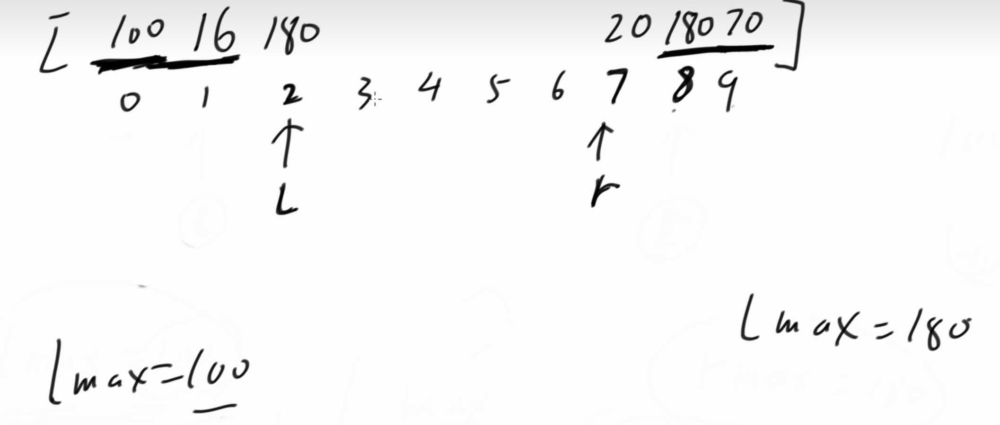

# 双指针技巧

设置两个指针的技巧，其实这种说法很宽泛，似乎 没什么可总结的

1. 有时候所谓的双指针技巧，就单纯是代码过程用双指针的形式表达出来而已。   没有单调性（贪心）方面的考虑
2. 有时候的双指针技巧包含**单调性（贪心）**方面的考虑，牵扯到可能性的取舍。   对分析能力的要求会变高。其实是**先有的思考和优化**，然后代码变成了 双指针的形式。
3. 所以，双指针这个“皮”不重要，**分析题目单调性（贪心）方面的特征**，这个能力才重要。

常见的双指针类型：

1）同向双指针

2）快慢双指针

3）从两头往中间的双指针

4）其他


## 题目1: 按奇偶排序数组II


## 题目2:


## 题目3: 接雨水

接雨水：

给定 n 个非负整数表示每个宽度为 1 的柱子的高度图，计算按此排列的柱子，下雨之后能接多少雨水

测试链接 : https://leetcode.cn/problems/trapping-rain-water/

注意：二维接雨水问题，会在宽度优先遍历的章节讲述，后续的【必备】课程


思路：

> 当来到i位置，求该位置所能接的最大雨水。
>
> 前提：需要知道0～i-1位置的最大值，需要知道i+1 ～ n-1的最大值。
>
> 这两个值小的那个就是i位置所能接雨水的限制。
>
> 那么此时：雨水 = min（Lmax(i-1), Rmax(i+1)） - height(i) 
>
> 因为当前i的高度可能特别高，它不能接任何雨水，导致上面的值为负数，因此需要和0进行PK
>
> 所以：最总i位置的雨水 = max( 0 , min(Lmax(i-1), Rmax(i+1)) - height(i) )

```java
public int trap1(int[] height) {
    int[] leftMax = new int[height.length];
    leftMax[0] = height[0];
    int[] rightMax = new int[height.length];
    rightMax[height.length - 1] = height[height.length - 1];
    // 从左侧开始，每个位置上0～i最大值
    for (int i = 1; i < height.length; i++) {
        leftMax[i] = Math.max(height[i], leftMax[i - 1]);
    }
    // 从右侧开始，每个位置，i～n-1最大值
    for (int i = height.length - 2; i >= 0; i--) {
        rightMax[i] = Math.max(height[i], rightMax[i + 1]);
    }

    int ans = 0;
    // 第一个位置 ，和最后一个位置雨水必为0
    for (int i = 1; i < height.length - 1; i++) {
        ans += Math.max(0, Math.min(leftMax[i - 1], rightMax[i + 1]) - height[i]);
    }
    return ans;
}
```

双指针优化：

也是基于上面的思路进行的优化。

左指针L， 从左往右，右指针R，从右往左。

左侧最大值，Lmax， 右侧最大值：Rmax

那么：当L来到如下位置，

1. 比较左右两侧，如果LMAX小于等于Rmax，那么可以根据上面公式得到L位置的雨水，
2. 尝试更新Lmax的值，
3. L++

右边同理。

记住：哪边小，就可以计算出那边位置上的雨水量。因为假设 0～i 位置LMAX，一定能跟RMAX组成的一个方框构成一个可以装容器部分




代码：

```java
public int trap2(int[] height) {
    int leftMax = height[0];
    int rightMax = height[height.length - 1];
    int left = 1, right = height.length - 2;
    int ans = 0;
    while (left <= right) {
        if (leftMax <= rightMax) {
            ans += Math.max(leftMax - height[left], 0);
            leftMax = Math.max(leftMax, height[left++]); // 更新leftMax并且left++
        } else {
            ans += Math.max(rightMax - height[right], 0);
            rightMax = Math.max(rightMax, height[right--]);
        }
    }
    return ans;
}
```